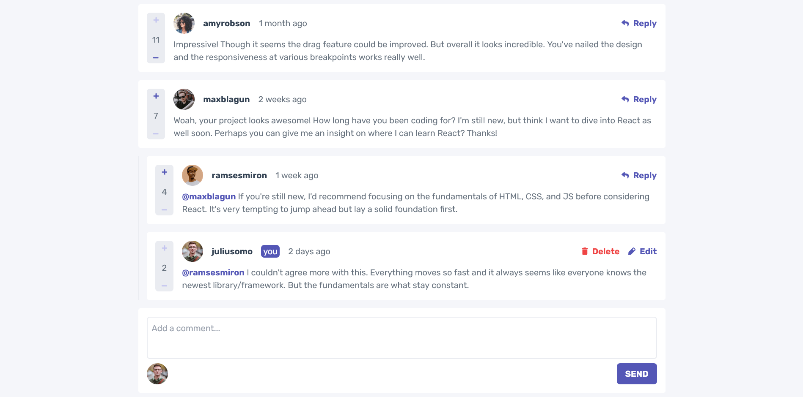

# Frontend Mentor - Interactive comments section solution

This is a solution to the [Interactive comments section challenge on Frontend Mentor](https://www.frontendmentor.io/challenges/interactive-comments-section-iG1RugEG9). Frontend Mentor challenges help you improve your coding skills by building realistic projects.

## Table of contents

- [Overview](#overview)
  - [The challenge](#the-challenge)
  - [Screenshot](#screenshot)
  - [Links](#links)
- [My process](#my-process)
  - [Built with](#built-with)
- [Author](#author)

## Overview

### The challenge

Users should be able to:

- View the optimal layout for the app depending on their device's screen size
- See hover states for all interactive elements on the page
- Create, Read, Update, and Delete comments and replies
- Upvote and downvote comments
- **Bonus**: If you're building a purely front-end project, use `localStorage` to save the current state in the browser that persists when the browser is refreshed.

### Screenshot

### Links

- Solution URL: https://www.frontendmentor.io/solutions/interactive-comments-section-dtoVeVev11
- Live Site URL: https://interactive-comments-section-brunofow.vercel.app/

## My process

### Built with

- Flexbox
- Mobile-first workflow
- [React](https://reactjs.org/) - JS library
- Tailwindcss

## Author

- Frontend Mentor - [@brunofow](https://www.frontendmentor.io/profile/brunofow)
- Linkedin - [Bruno Campos Lima Batista](https://www.linkedin.com/in/brunofow/)
